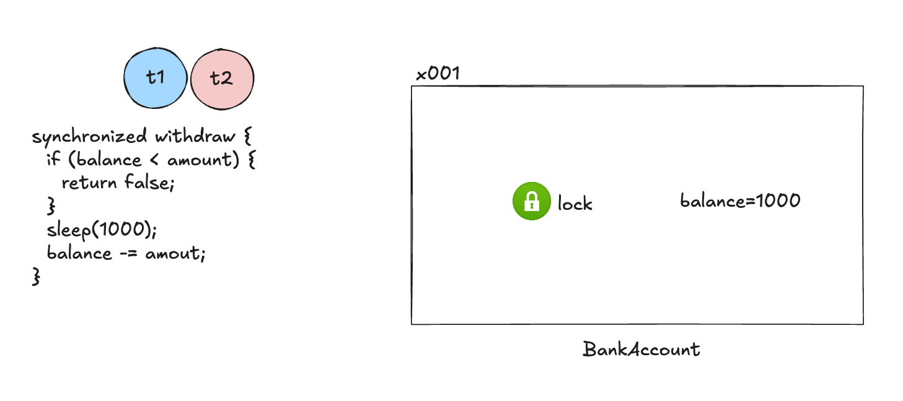
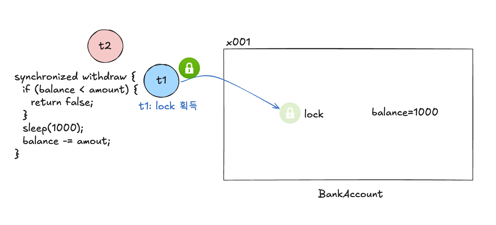
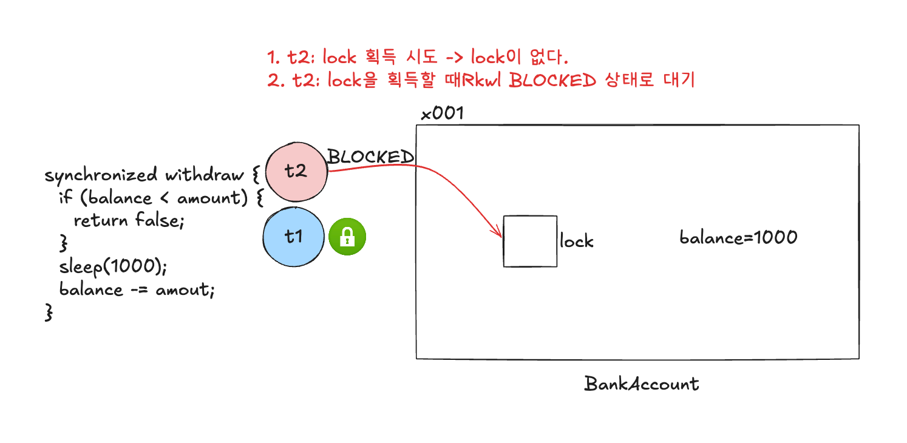
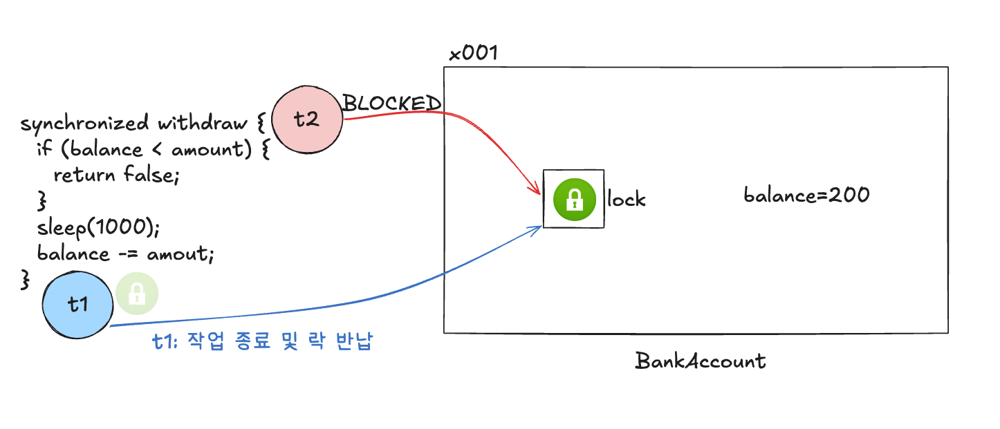
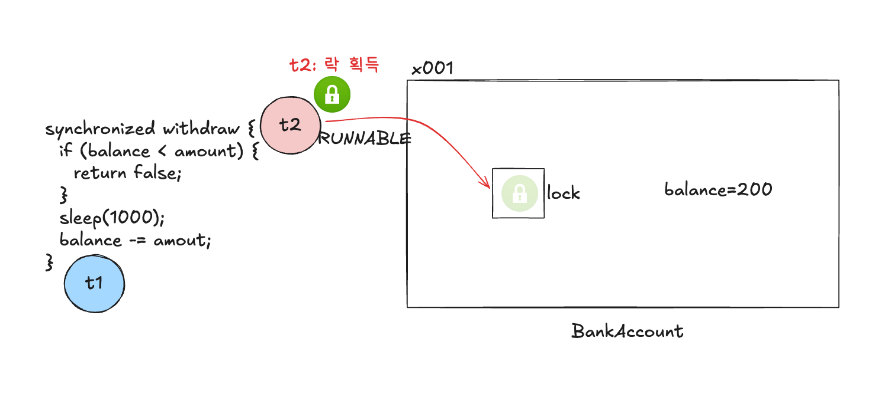

# 임계 영역

### 공유 자원

- 여러 스레드가 함께 사용하는 자원.

### 한번에 하나의 스레드만 실행

- 공유 자원을 한번에 하나의 스레드만 실행할 수 있게 제한?
  - 하나의 스레드가 공유 자원을 사용하면, 다른 스레드가 접근하지 못한다. 

### 임계 영역 critical section

- 여러 스레드가 동시에 접근하면 데이터 불일치나 예상치 못한 동작이 발생할 수 있는 위험하고, 중요한 코드 부분.
- 여러 스레드가 동시에 접근해서는 안 되는 공유 자원에 접근하거나 수정하는 부분

---

# `synchronized` 메소드

- 하나의 스레드만 실행할 수 있는 코드 구간을 만드는 방법

```java
public synchronized boolean withdraw(int amount) {
  // ...
}
```

### synchronized 분석



- 모든 객체(인스턴스)는 내부에 자신만의 락을 가지고 있다.
  - `모니터 락 monitor lock`이라고도 부른다.
  - 객체 내부에 있고 우리가 확인하기는 어렵다.
- 스레드가 `synchronized` 키워드가 있는 메소드에 진입하려면 반드시 해당 인스턴스의 락이 있어야 한다.
  - 여기서는 `BankAccount(x001)` 인스턴스의 `synchronized withdraw()` 메소드를 호출하므로 이 인스턴스의 락이 필요하다.




- 여기서 `t1`이 먼저 실행된다고 해보자.
- `synchronized` 메소드를 호출하려면 먼저 해당 인스턴스의 락이 필요하다.
  - 락이 있으므로 `t1`은 락을 획득할 수 있다.



- 만약 여기서 `t2`가 `withdraw()` 메소드에 접근한다면?
  - 락이 필요하기 때문에 락 획득을 시도할텐데, 락이 없기 때문에 락을 획득할 때까지 `BLOCKED` 상태로 대기하게 된다. (`RUNNABLE` -> `BLOCKED`)
  - 획득할 때까지 무한정 대기한다.
- 참고로 `BLOCKED` 상태가 되면 락을 다시 획득하기 전까지는 계속 대기하고, CPU 실행 스케줄링에 들어가지 않는다.



- `t1`이 작업을 끝내면 락을 반납한다.



- `t2`는 락을 자동으로 획득하게 되고, `BLOCKED` 상태에서 `RUNNABLE` 상태로 변경된다. 그리고 코드를 실행한다.
- `synchronized`는 이와 같이 하나의 스레드만 접근할 수 있도록 임계 영역 구간을 만들 수 있는 것이다.

> #### 참고: 락을 획득하는 순서는 보장되지 않는다.
> - `synchronized` 락을 획득할 때, 어떤 순서로 락을 획득하는지는 자바 표준에 정의되어 있지 않다. 따라서 순서를 보장하지 않고, 환경에 따라서 순서가 달라질 수 있다.

> #### 참고
> - `volatile`을 사용하지 않아도 `synchronized` 안에서 접근하는 변수 메모리 가시성 문제는 해결된다.

----

# `synchronized` 코드 블럭

- `synchronized`를 통해 동시에 실행할 수 없는 구간. 필요한 곳으로 한정해서 설정해야 한다.
- 아래와 같이 임계 영역 부분에만 `synchronized`를 적용할 수도 있다.

```java
public boolean withdraw(final int amount) {
  // ...

  // === 임계 영역 시작 ===
  synchronized (this) {
    // ...
  }
  // === 임계 영역 종료 ===

  // ...
}
```

---

# 정리

- 동기화를 사용하면 다음 문제들을 해결할 수 있다.
  - `경합 조건(Race Condition)`: 두 개 이상의 스레드가 경쟁적으로 동일한 자원을 수정할 때 발생하는 문제.
  - `데이터 일관성`: 여러 스레드가 동시에 읽고 쓰는 데이터의 일관성을 유지
- 멀티스레드 환경에서 필수적인 기능이지만, 과도하게 사용할 경우 성능 저하를 초래할 수 있으므로 필요한 곳에서만 사용해야 한다.

