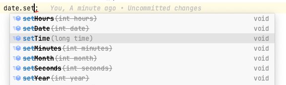

# Java Time

## java.util.Date

- Java 1.0부터 사용했고, 1.1에서 `Calendar`가 생기기 전까지는 유일하게 날짜 연산을 지원하는 클래스였다.

```java
Date date = new Date();
```

#### java.sql의 시간 객체

- `java.util.Date`를 상속받아 `java.sql.Date`와 `java.sql.Timestamp`라는 객체를 만들었다.

```java
package java.sql;
public class Date extends java.util.Date {}
public class Timestamp extends java.util.Date {}
```

- `java.sql.Date`는 년/월/일 정보만 가지고 있다. 내부적으로 시간을 00:00:00으로 설정한다.
  - 주로 SQL의 DATE 타입과 매핑된다.
- `java.sql.Timestamp`는 년/월/일 + 시:분:초:밀리초 정보를 포함하고 있다.
  - SQL의 TIMESTAMP와 매핑된다.

> #### `DATETIME`과 `TIMESTAMP`의 차이
> - `DATETIME`은 '1000-01-01 00:00:00'부터 '9999-12-31 23:59:59'까지의 날짜와 시간을 저장
>   - `DATETIME`을 저장하려면 8Byte의 공간이 필요하다
> - `TIMESTAMP`는 '1970-01-01 00:00:01 UTC'에서 '2038-01-19 03:14:07 UTC'까지의 날짜와 시간을 저장
>   - `DATETIME`보다 적은 시간 범위를 가지기에 4Byte로 저장한다.

### 문제점

- `Date`는 아래와 같은 치명적인 문제가 있기 때문에 현재로선 대부분의 개발자들이 사용을 지양하고 있다.

#### 불변 객체가 아니다.

- 날짜와 시간과 관련된 객체는 보통 Value Object로 `value`로 값의 동등성을 판단한다.
    - `Date` 객체는 불변 객체가 아니기 때문에 내부 속성을 바꿀 수 있기 때문에 예상치 못한 사이드 이펙트가 발생할 수 있다.
    - 아래 이미지와 같이 수많은 `setter`가 있지만 현재 `setTime(long time)`을 제외하곤 Deprecated 처리가 되어 있다.



#### API가 직관적이지 않다.

- 아래와 같이 실행하면 어떤 `Date`에 어떤 값이 담길 거라고 생각할까? 
- 보통은 2024년 10월 13일을 기대하겠지만, 실제로 출력해보면 3924년 11월 13일을 보여준다.

```java
final Date date = new Date(2024, 10 ,13);
```

- `Date`는 month 값으로 0~11을 사용하기 때문에 실제 달과 `Date`의 month가 일치되지 않는다.
- 또한 연도를 입력할 때 1900을 기준으로 연도를 입력해야 한다는 문제도 있다.
- 따라서 2024년 10월 13일을 입력하길 원한다면 아래와 같은 값을 넣어줘야 한다.

```java
final Date date = new Date(124, 9 ,13);
```

- `Date`의 이러한 방식에 문제가 있다고 여겨 연/월/일을 입력하는 방식을 Deprecated하고 milliseconds를 입력하는 방식을 채택했다. 덕분에 불편..
- 이 문제는 `java.sql.Date`와 `java.sql.Timestamp`에도 그대로 적용된다.
  - `Date`와 마찬가지로 연/월/일을 입력하는 방식을 Java 1.2를 기점으로 Deprecated하고 `milliseconds`를 받는 방식을 채택하고 있다.

#### 날짜 포맷팅을 지원하지 않는다.

- 날짜 포맷팅을 직접 지원하지 않기 때문에 `SimpleDateFormat`을 사용해야만 하는 불편함이 있다.

```java
SimpleDateFormat simpleDateFormat = new SimpleDateFormat("yyyy-MM-dd HH:mm:ss");
System.out.println(simpleDateFormat.format(date));
```

<br/>

## java.util.Calendar

- Java 1.1부터 사용했던 API로 굉장히 오래됐다.
- 1970년 1월 1일부터 사용할 수 있다.
- Calendar는 `Date`와 달리 추상클래스이기 때문에 `getInstance()`를 통해 구현체를 생성해야 한다.
- - 역법에 따라 다른 구현체를 사용할 수 있는데, 보통 그레고리력을 사용하기 때문에 `GregorianCalendar`을 사용한다.
  - `GregorianCalendar`, `BuddhistCalendar`, `JapaneseImperialCalendar`. 총 세 가지의 구현체가 있다.
  - `GregorianCalendar`는 율리우스력도 지원한다.. ㄷㄷ

```java
Calendar calendar = Calendar.getInstance();
```

### 문제점

#### API가 직관적이지 않다.

- month를 0~11로 알려주기 때문에 직관성이 떨어진다.

#### 불변 객체가 아니다.

- `Calendar.set()` 메소드를 통해 필드 변수를 수정할 수 있으며, 이로 인해 예기치 못한 사이드 이펙트가 발생할 수 있다.

#### 날짜 계산이 어렵다.

- 아래와 같이 어떤 필드를 계산할지 매번 지정해줘야 하기 때문에 굉장히 불편하다.

```java
calendar.add(Calendar.DATE, 2);
calendar.add(Calendar.DATE, -5);

calendar.add(Calendar.WEEK_OF_MONTH, 3);
calendar.add(Calendar.WEEK_OF_MONTH, -7);
```

#### 날짜 포맷팅을 지원하지 않는다.

- Calendar는 날짜 포맷팅을 직접 지원하지 않기 때문에 `SimpleDateFormat`을 사용해야만 하는 불편함이 있다.

```java
SimpleDateFormat simpleDateFormat = new SimpleDateFormat("yyyy-MM-dd HH:mm:ss");
System.out.println(simpleDateFormat.format(calendar.getTime()));
```

#### 타임존 설정을 잘못해도 에러가 발생하지 않는다.

- 타임존을 한국 서울에 맞추고 싶다면 타임존에 `Asia/Seoul`을 입력해줘야 한다.
- 그런데 `Seoul/Asia`로 잘못 입력한다면 어떻게 될까? Calendar에서는 아무런 문제도 발생하지 않는다. 그냥 타임존이 설정되지 않는다.

```java
TimeZone timeZoneUTC = TimeZone.getTimeZone("");
calendar.setTimeZone(timeZoneUTC);
```

- 반면 `java.time`에서 사용하는 ZoneId에서는 잘못 입력할 경우 에러를 발생시킨다.

```java
ZoneId zoneId = ZoneId.of("Seoul/Asia");
ZonedDateTime zonedDateTime = dateTime.atZone(zoneId);
```

```shell
Exception in thread "main" java.time.zone.ZoneRulesException: Unknown time-zone ID: Seoul/Asia
	at java.base/java.time.zone.ZoneRulesProvider.getProvider(ZoneRulesProvider.java:281)
	at java.base/java.time.zone.ZoneRulesProvider.getRules(ZoneRulesProvider.java:236)
	at java.base/java.time.ZoneRegion.ofId(ZoneRegion.java:121)
	at java.base/java.time.ZoneId.of(ZoneId.java:411)
	at java.base/java.time.ZoneId.of(ZoneId.java:359)
	at com.pythonstrup.time.calendar.CalendarExample.main(CalendarExample.java:29)
```

<br/>

## java.time의 LocalTime, LocalDate, LocalDateTime

- Java 8부터 사용할 수 있으며, Date와 Calendar의 단점이었던 가변성을 보완했다. 이 객체들은 모두 불변 객체이다.

### with 메소드

- with 메소드를 사용해 새로운 인스턴스를 반환받을 수 있다.


<br/>

# 참고자료

- [Java의 날짜와 시간 API](https://d2.naver.com/helloworld/645609?source=post_page---------------------------)